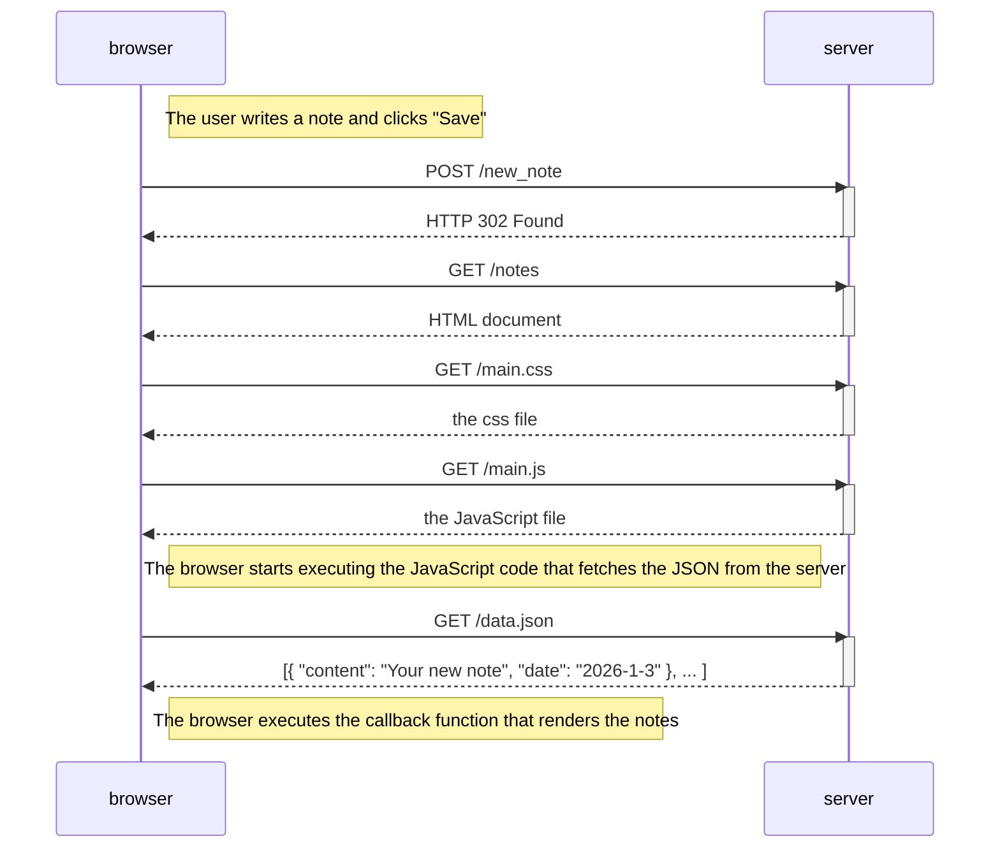

```mermaid
sequenceDiagram
    participant browser
    participant server

    Note right of browser: The user writes a note and clicks "Save"

    browser->>server: POST /new_note
    activate server
    server-->>browser: HTTP 302 Found
    deactivate server

    browser->>server: GET /notes
    activate server
    server-->>browser: HTML document
    deactivate server

    browser->>server: GET /main.css
    activate server
    server-->>browser: the css file
    deactivate server

    browser->>server: GET /main.js
    activate server
    server-->>browser: the JavaScript file
    deactivate server

    Note right of browser: The browser starts executing the JavaScript code that fetches the JSON from the server

    browser->>server: GET /data.json
    activate server
    server-->>browser: [{ "content": "Your new note", "date": "2026-1-3" }, ... ]
    deactivate server

    Note right of browser: The browser executes the callback function that renders the notes
```
