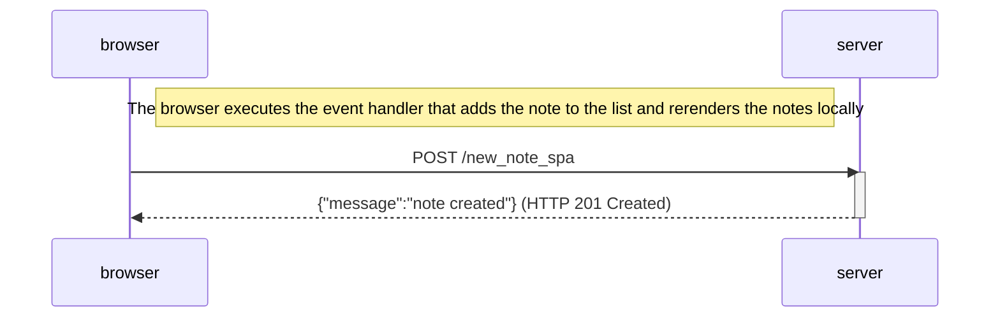

# Exercise 0.6 Diagram

```mermaid
sequenceDiagram
    participant browser
    participant server

    Note right of browser: The browser executes the event handler that adds the note to the list and rerenders the notes locally

    browser->>server: POST /new_note_spa
    activate server
    server-->>browser: {"message":"note created"} (HTTP 201 Created)
    deactivate server
```
